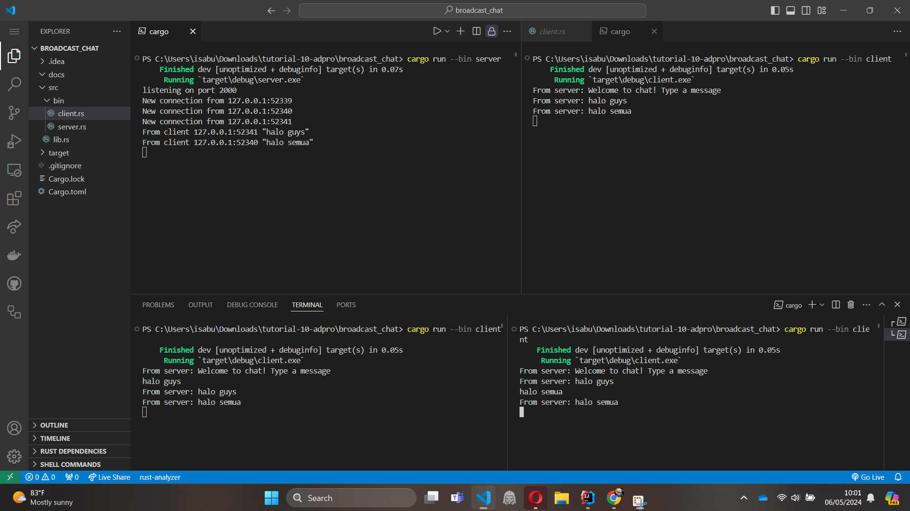

Di sini, klien melakukan koneksi ke server melalui WebSocket di Rust. Jika salah satu klien mengirim pesan ke server, server akan membalas pesan
tersebut kepada semua koneksi WebSocket yang terhubung.