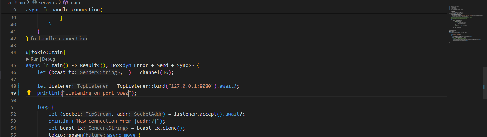
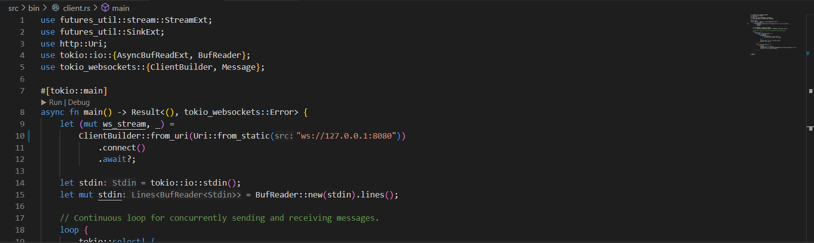
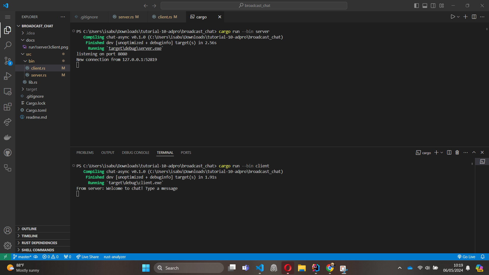
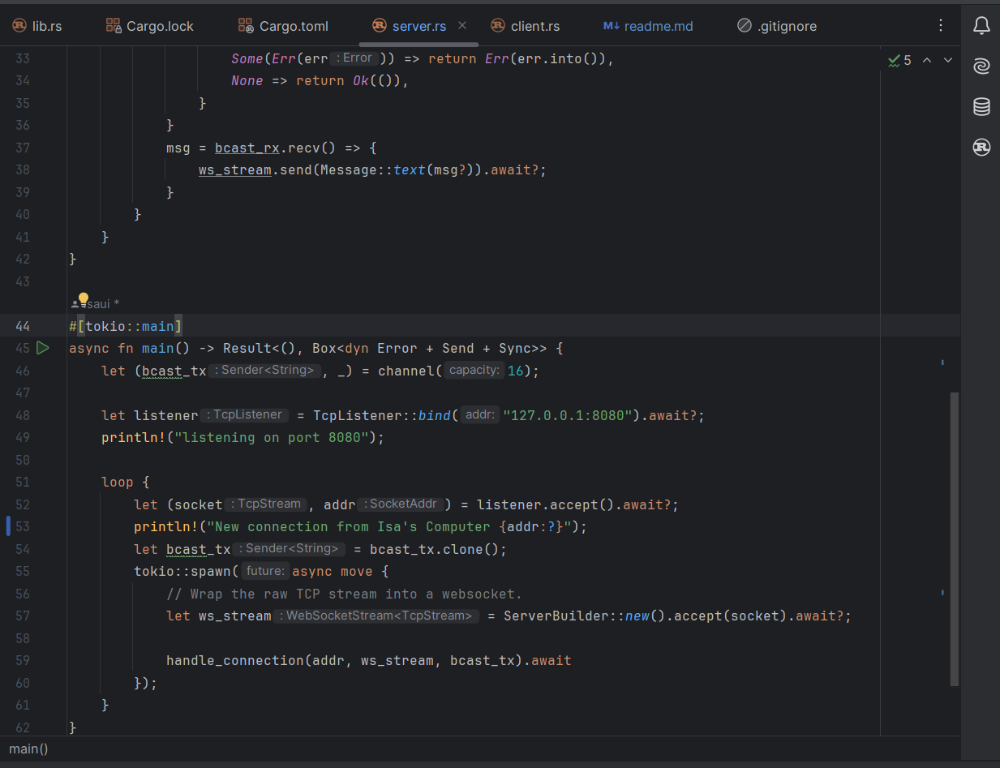
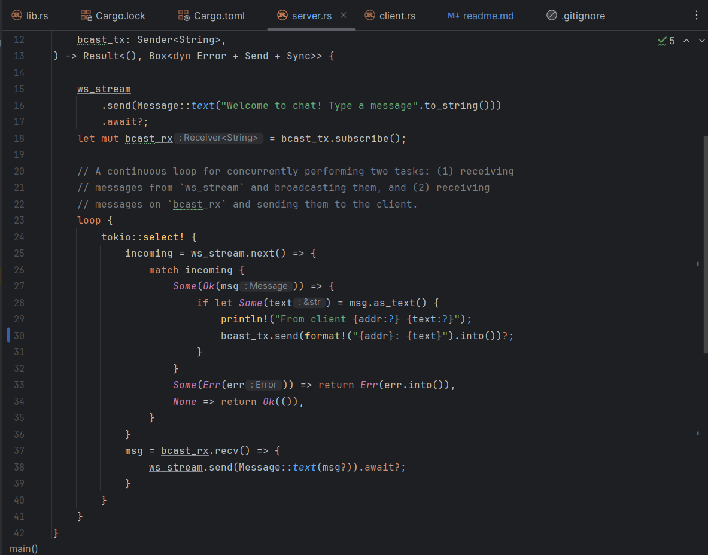
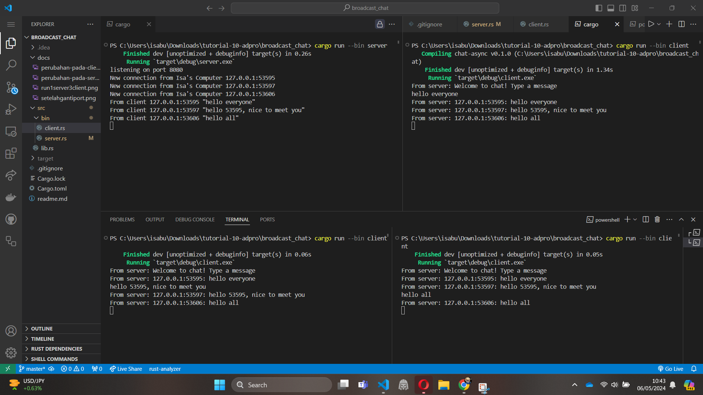

Di sini, klien melakukan koneksi ke server melalui WebSocket di Rust. Jika salah satu klien mengirim pesan ke server, server akan membalas pesan
tersebut kepada semua koneksi WebSocket yang terhubung.

Saya mengubah port dari 2000 ke 8080 pada server

Saya turut mengubah port dari 2000 ke 8080 pada client

Program tetap berjalan dengan baik karena server dan client memiliki protokol TCP yang sama
dan terkoneksi pada address yang sama dengan port yang sama.

Selanjutnya saya menambahkan ip asal client pada pesan
yang dikirimkan oleh server.
